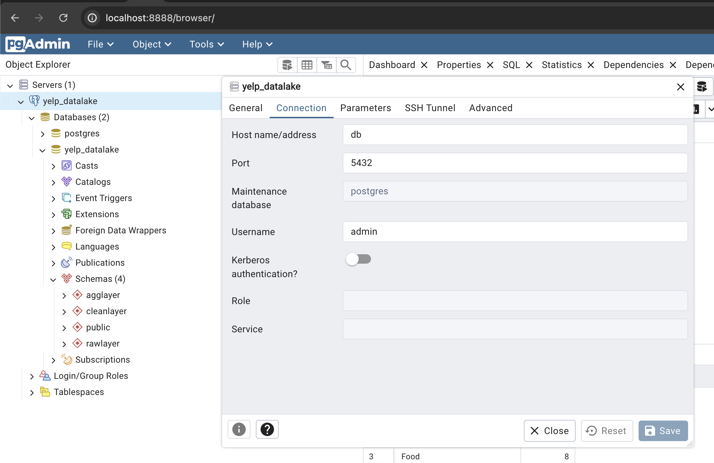
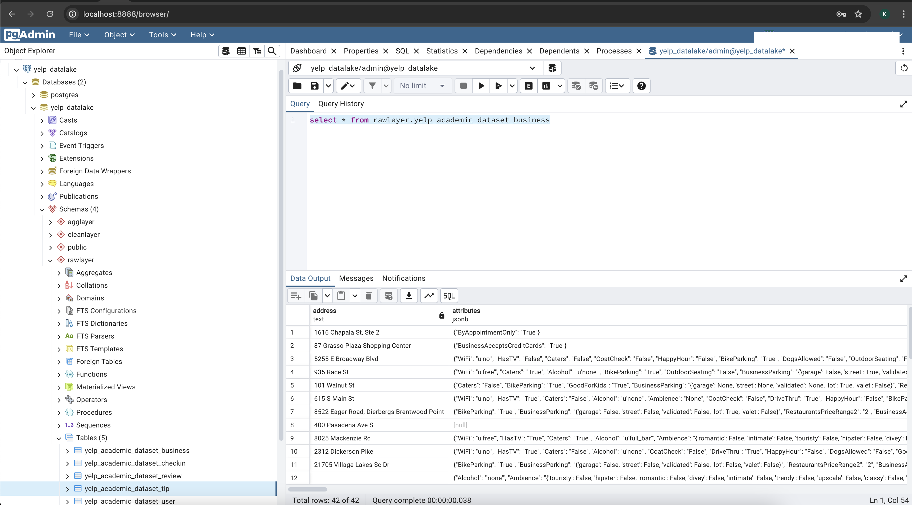

# Overview of this section
### To SetUp a Small Datalake using yelp dataset on Postgres DB setup & pgadmin, For This ETL is done using PySpark.All Setup are done using Docker and Docker Compose.  

---
## Requirements of datalake & Application
- It should consist of raw, cleaned and aggregated Yelp data.
- All JSON files should be part of the raw data.
- Consider all raw files for cleaning.
- The aggregation should at least include the stars per business on a weekly basis and the number of check-ins of a business compared to the overall star rating.
- Package your PySpark application as a Docker container (or multiple containers).


---
## Prerequistes

- Docker Desktop Installed
- Java Installed.
- Open Mind.
- Yelp Dataset Download and place under source_data/jsonfiles folder of the repo.(Since Dataset is ~6-8 GB , so not keeping the entire original with the repository)
---	    
             		

## Code Base Structure 
```bash
.
├── Makefile
├── README.md
├── docker
│      ├── Dockerfile
│      ├── docker-compose.yml
│      ├── init_db_data
│      │          └── init.sh
│      ├── pgadminenv
│      ├── postgresenv
│      └── requirements.txt
├── pics
│     ├── PGADMIN_SETUP.png
│     └── SAMPLE_DATA.png
├── source_data
│          └── jsonfiles
│              ├── yelp_academic_dataset_business.json
│              ├── yelp_academic_dataset_checkin.json
│              ├── yelp_academic_dataset_review.json
│              ├── yelp_academic_dataset_tip.json
│              └── yelp_academic_dataset_user.json
├── src
     └── spark
         ├── etl_agglayer.py
         ├── etl_cleanlayer.py
         ├── etl_rawlayer.py
         └── utils.py
```

---

## Docker Components
1. Postgres from [Postgres DockerImage](https://hub.docker.com/_/postgres)
2. PgAdmin from [Pgadmin DockerImage](https://hub.docker.com/r/dpage/pgadmin4)
3. Spark from [Spark DockerImage](https://hub.docker.com/r/bitnami/spark)

### Docker Compose
1. All the Above Docker's are bundled together using docker compose.
2. Postgres
   1. There is a folder init_db_data which is mapped to volume of postgres container 'docker-entrypoint-initdb.d'
   2. Inside postgres container will be executed init.sh ( Shell script ) which has all the DDLs.
   3. There are 2 env files which needs to be looked at
      1. pgadminenv - These details will be used to authenticate pgadmin login later.( Provide your own Dummy EMAIL to set)
      2. postgresenv - These details will be set to be used by apps to make connection with postgres DB.
3. Upon Successful completion you should be able to see all containers running in docker desktop.
4. pgadmin
   1. It is mapped to port 8888, so we can navigate to [pgadmin](http://localhost:8888/) to login .(Use Credential provided in pgadminenv file)
   
   2. Sample Data check 
   
5. Spark
   1. Its been setup along with JDBC Jar in its dockerfile, Since JDBC Jar is needed to make connection to Postgres
   2. It is set to run 1 Master and 2 workers 
---

---
##  DATABASE DESIGN
1. 3 Layers are created in postgres datalake
2. Each Layer serves different purpose.
3. The Source Data is JSON , so the JSON Data will be part of rawlayer as per requirement.

Following are the List of schemas and tables created.
- Schema
   1. rawlayer - This has the raw information of source json files
      1. yelp_academic_dataset_business
      2. yelp_academic_dataset_checkin
      3. yelp_academic_dataset_review 
      4. yelp_academic_dataset_tip 
      5. yelp_academic_dataset_user
   2. cleanlayer - This has the clean information of the raw layer data
      1. yelp_academic_dataset_business 
      2. yelp_academic_dataset_checkin 
      3. yelp_academic_dataset_review 
      4. yelp_academic_dataset_tip
      5. yelp_academic_dataset_user
   3. agglayer - This has the aggregated information for KPI derivations further usecase.
      1. business_stars_weekly
      2. no_of_checkin_overall_rating
      3. popular_categories

---
## Orchestration/ How to Run
- Everything is handled Via make command , For this Makefile is created and all the instructions are provided inside.
- Once below Building the environment setup is done, Then proceed with executing make command with instructions.
- Once the Containers are up and running , run the PySpark ETL job which will load the JSON Files provided under /source_data/jsonfile directory.
- Login to PGADMIN and start analyzing the data. 


## Building the environment

```bash
# Clone the repo
git clone https://github.com/KumarRoshandot/yelp_smalldatalake_docker_postgres_pgadmin_spark.git

# Create the environment
cd yelp_smalldatalake_docker_postgres_pgadmin_spark
make help

# To Run all the container using docker compose
make all

# To Run the ETL Job 
make run-etl-jobs

# To Stop and terminate all Containers and services 
make wipeout-everything 
```


---
### Some Tips
1. We can Leverage the orchestration using Airflow as well to run ETL Pipeline.
2. To Run ETL with the large dataset , In That case SPARK DRIVER and WORKER Configuration can be changed in docker compose file.
3. To Visually see the KPI we can leverage any BI Tool to make connection with postgres and get the data.
